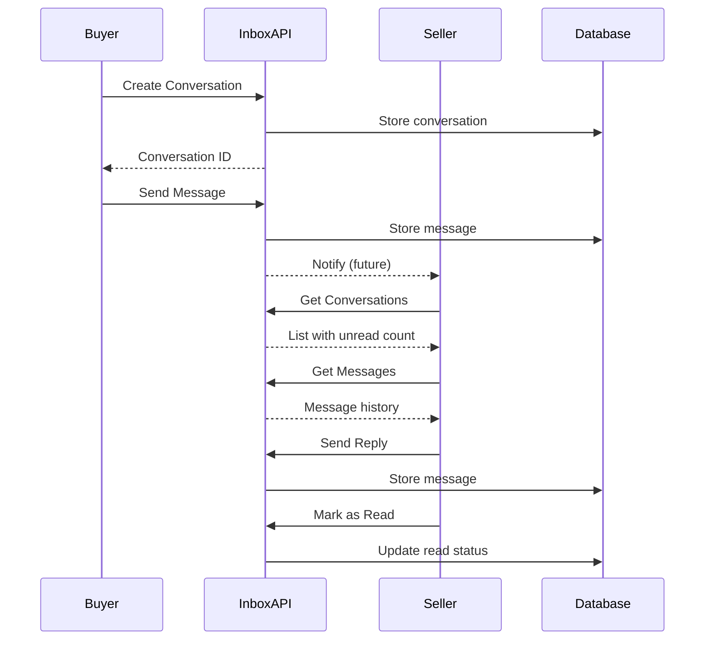

# Inbox / Messaging API

## Overview
The Inbox API manages conversations and messages between buyers and sellers. It provides functionality for creating conversations, sending messages, retrieving message history, and marking messages as read.

## Base URL
```
/inbox
```

## Authentication
All endpoints require authentication via signed cookie.

---

## Conversation and Messaging Flow



---

## Endpoints

### 1. Create Conversation

Creates a new conversation between companies (typically buyer and seller).

**Endpoint:** `POST /inbox/create-conversation`

**Authentication:** Required (signed cookie)

**Request Body:**
```json
{
  "receiverCompanyId": "string",  // MongoDB ObjectId of the receiving company
  "context": "string",            // Optional: Context (e.g., "trade", "product_inquiry")
  "contextId": "string"           // Optional: Related entity ID (productId, tradeId, etc.)
}
```

**Response:**

**Success (201 Created):**
```json
"string"  // Conversation ID (MongoDB ObjectId)
```

**Error Responses:**

**400 Bad Request:**
```json
{
  "statusCode": 400,
  "message": "error message"
}
```
*Possible reasons:*
- Conversation already exists between these companies
- Invalid receiverCompanyId
- Missing required fields

**401 Unauthorized:**
```json
{
  "statusCode": 401,
  "message": "No valid cookie found"
}
```
or
```json
{
  "statusCode": 401,
  "message": "Invalid token"
}
```

**Implementation Notes:**
- `senderCompanyId` is automatically extracted from JWT token
- Prevents duplicate conversations between same companies
- Returns the conversation ID for immediate use

---

### 2. Get User's Conversations

Retrieves all conversations for the authenticated user's company.

**Endpoint:** `GET /inbox/get-conversations`

**Authentication:** Required (signed cookie)

**Request:** No parameters required

**Response:**

**Success (200 OK):**
```json
[
  {
    "_id": "string",
    "participants": ["companyId1", "companyId2"],
    "context": "string",
    "contextId": "string",
    "lastMessage": "string",
    "lastMessageTimestamp": "2024-01-01T00:00:00.000Z",
    "unreadCount": {
      "companyId1": 0,
      "companyId2": 3
    },
    "createdAt": "2024-01-01T00:00:00.000Z",
    "updatedAt": "2024-01-01T00:00:00.000Z",
    // Populated participant details
    "participantDetails": [
      {
        "_id": "string",
        "companyName": "string",
        "role": "Buyer" | "Seller" | "Seller and Buyer"
      }
    ]
  }
  // ... more conversations
]
```

**Error Responses:**

**401 Unauthorized:**
```json
{
  "statusCode": 401,
  "message": "No valid cookie found"
}
```

**Implementation Notes:**
- Returns conversations where user's company is a participant
- Sorted by `lastMessageTimestamp` (most recent first)
- Includes unread message count per participant
- Populates participant company details

---

### 3. Get Messages in Conversation

Retrieves all messages in a specific conversation.

**Endpoint:** `GET /inbox/:conversationId/messages`

**Authentication:** Required (signed cookie)

**Path Parameters:**
- `conversationId` (string, required): MongoDB ObjectId of the conversation

**Request Example:**
```
GET /inbox/507f1f77bcf86cd799439011/messages
```

**Response:**

**Success (200 OK):**
```json
[
  {
    "_id": "string",
    "conversationId": "string",
    "senderCompanyId": "string",
    "text": "string",
    "readBy": ["companyId1"],
    "createdAt": "2024-01-01T00:00:00.000Z",
    "sender": {
      // Populated sender company details
      "_id": "string",
      "companyName": "string",
      "role": "string"
    }
  }
  // ... more messages, ordered chronologically
]
```

**Error Responses:**

**401 Unauthorized:**
```json
{
  "statusCode": 401,
  "message": "No valid cookie found"
}
```
or
```json
{
  "statusCode": 401,
  "message": "No companyId found"
}
```

**403 Forbidden:**
```json
{
  "statusCode": 403,
  "message": "Access denied - not a participant in this conversation"
}
```

**Implementation Notes:**
- Verifies user's company is a participant in the conversation
- Messages ordered chronologically (oldest first)
- Sender company details are populated
- All messages in the conversation are returned

---

### 4. Send Message

Sends a message in a conversation.

**Endpoint:** `POST /inbox/:conversationId/send-message`

**Authentication:** Required (signed cookie)

**Path Parameters:**
- `conversationId` (string, required): MongoDB ObjectId of the conversation

**Request Body:**
```json
{
  "text": "string"  // Message text content
}
```

**Request Example:**
```
POST /inbox/507f1f77bcf86cd799439011/send-message
{
  "text": "Hello, I'm interested in this product."
}
```

**Response:**

**Success (201 Created):**
```json
{
  "_id": "string",
  "conversationId": "string",
  "senderCompanyId": "string",
  "text": "string",
  "readBy": ["senderCompanyId"],
  "createdAt": "2024-01-01T00:00:00.000Z"
}
```

**Error Responses:**

**401 Unauthorized:**
```json
{
  "statusCode": 401,
  "message": "No valid cookie found"
}
```
or
```json
{
  "statusCode": 401,
  "message": "No companyId found"
}
```

**500 Internal Server Error:**
```json
{
  "statusCode": 500,
  "message": "Failed to send message"
}
```

**Implementation Notes:**
- Automatically extracts `senderCompanyId` from JWT token
- Message is marked as read by sender automatically
- Updates conversation's `lastMessage` and `lastMessageTimestamp`
- Increments unread count for other participants

---

### 5. Mark Messages as Read

Marks all messages in a conversation as read by the authenticated user's company.

**Endpoint:** `POST /inbox/:conversationId/mark-read`

**Authentication:** Required (signed cookie)

**Path Parameters:**
- `conversationId` (string, required): MongoDB ObjectId of the conversation

**Request Body:** None required

**Request Example:**
```
POST /inbox/507f1f77bcf86cd799439011/mark-read
```

**Response:**

**Success (200 OK):**
```json
{
  "success": true
}
```

**Error Responses:**

**401 Unauthorized:**
```json
{
  "statusCode": 401,
  "message": "No valid cookie found"
}
```
or
```json
{
  "statusCode": 401,
  "message": "No companyId found"
}
```

**500 Internal Server Error:**
```json
{
  "statusCode": 500,
  "message": "Failed to mark messages as read"
}
```

**Implementation Notes:**
- Adds user's companyId to `readBy` array of all unread messages
- Updates conversation's unread count for the user's company
- Idempotent operation (safe to call multiple times)

---

## Data Models

### Conversation Schema
```typescript
{
  _id: ObjectId;
  participants: ObjectId[];           // Array of company IDs
  context?: string;                   // e.g., "trade", "product_inquiry"
  contextId?: ObjectId;              // Related entity ID
  lastMessage?: string;              // Text of last message
  lastMessageTimestamp?: Date;       // When last message was sent
  unreadCount: {
    [companyId: string]: number;    // Unread count per participant
  };
  createdAt: Date;
  updatedAt: Date;
}
```

### Message Schema
```typescript
{
  _id: ObjectId;
  conversationId: ObjectId;          // Ref: Conversation
  senderCompanyId: ObjectId;         // Ref: Company
  text: string;                      // Message content
  readBy: ObjectId[];                // Array of company IDs who read the message
  createdAt: Date;
}
```

---

## Frontend Integration Notes

### 1. Conversation List (Inbox)

**Display:**
```jsx
<ConversationList>
  {conversations.map(conv => (
    <ConversationItem key={conv._id}>
      <Avatar company={getOtherParticipant(conv)} />
      <ConversationInfo>
        <CompanyName>{getOtherParticipant(conv).companyName}</CompanyName>
        <LastMessage>{conv.lastMessage}</LastMessage>
        <Timestamp>{formatTime(conv.lastMessageTimestamp)}</Timestamp>
      </ConversationInfo>
      {conv.unreadCount[myCompanyId] > 0 && (
        <UnreadBadge>{conv.unreadCount[myCompanyId]}</UnreadBadge>
      )}
    </ConversationItem>
  ))}
</ConversationList>
```

**Features:**
- Sort by `lastMessageTimestamp` (most recent first)
- Show unread count badge
- Highlight unread conversations
- Display last message preview
- Show other participant's company name
- Click to open conversation

### 2. Message Thread

**Display:**
```jsx
<MessageThread>
  {messages.map(msg => (
    <Message 
      key={msg._id}
      isOwn={msg.senderCompanyId === myCompanyId}
    >
      <MessageBubble>
        <Text>{msg.text}</Text>
        <Timestamp>{formatTime(msg.createdAt)}</Timestamp>
        {msg.readBy.length > 1 && <ReadReceipt />}
      </MessageBubble>
    </Message>
  ))}
</MessageThread>

<MessageInput onSend={sendMessage} />
```

**Features:**
- Auto-scroll to bottom on new messages
- Different styling for own vs other's messages
- Show read receipts
- Display timestamps
- Loading states while sending

### 3. Creating Conversations

**From Product Page:**
```javascript
const contactSeller = async (productId, sellerId) => {
  // Check if conversation exists
  const existing = conversations.find(c => 
    c.participants.includes(sellerId)
  );
  
  if (existing) {
    navigateTo(`/inbox/${existing._id}`);
  } else {
    const convId = await createConversation({
      receiverCompanyId: sellerId,
      context: 'product_inquiry',
      contextId: productId
    });
    navigateTo(`/inbox/${convId}`);
  }
};
```

**From Trade:**
```javascript
const messageSeller = async (trade) => {
  const convId = await createConversation({
    receiverCompanyId: trade.seller.company._id,
    context: 'trade',
    contextId: trade._id
  });
  navigateTo(`/inbox/${convId}`);
};
```

### 4. Real-time Updates (Future Enhancement)

**WebSocket Integration:**
```javascript
// Subscribe to conversation updates
socket.on('new_message', (message) => {
  if (message.conversationId === currentConversationId) {
    appendMessage(message);
    markAsRead(message.conversationId);
  } else {
    updateUnreadCount(message.conversationId);
  }
});

// Send message via WebSocket
const sendMessage = (text) => {
  socket.emit('send_message', {
    conversationId,
    text
  });
};
```

### 5. Unread Count Display

**Global Unread Count:**
```javascript
const totalUnread = conversations.reduce((sum, conv) => 
  sum + (conv.unreadCount[myCompanyId] || 0), 0
);

// Display in navigation
<InboxIcon badge={totalUnread > 0 ? totalUnread : null} />
```

### 6. Mark as Read Strategy

**Option 1: On Conversation Open**
```javascript
useEffect(() => {
  if (conversationId && messages.length > 0) {
    markAsRead(conversationId);
  }
}, [conversationId, messages]);
```

**Option 2: On Scroll to Bottom**
```javascript
const handleScroll = (e) => {
  const { scrollTop, scrollHeight, clientHeight } = e.target;
  if (scrollTop + clientHeight >= scrollHeight - 10) {
    markAsRead(conversationId);
  }
};
```

### 7. Message Polling (Until WebSockets)

```javascript
useEffect(() => {
  if (!conversationId) return;
  
  const interval = setInterval(() => {
    fetchMessages(conversationId);
  }, 3000); // Poll every 3 seconds
  
  return () => clearInterval(interval);
}, [conversationId]);
```

---

## Best Practices

1. **Performance:**
   - Paginate message history for long conversations
   - Implement virtual scrolling for large message lists
   - Cache conversation list locally

2. **User Experience:**
   - Show typing indicators (future)
   - Display "sending..." state for messages
   - Optimistic message rendering
   - Auto-scroll to bottom on new messages

3. **Notifications:**
   - Browser notifications for new messages
   - Update document title with unread count
   - Play sound on new message (with user preference)

4. **Error Handling:**
   - Retry failed message sends
   - Show error state for failed messages
   - Offline message queuing

---

## WebSocket Gateway

The Inbox module includes a WebSocket gateway for real-time messaging capabilities.

### Connection

**Namespace:** `/inbox`

**CORS:** Configured via `CORS_ORIGIN` environment variable (default: `*`)

### WebSocket Events

#### Client → Server Events

##### 1. join-conversation
Join a conversation room to receive real-time updates.

**Payload:**
```json
{
  "conversationId": "string",
  "companyId": "string"
}
```

**Response:**
```json
{
  "success": true,
  "room": "conversation-<conversationId>"
}
```

##### 2. leave-conversation
Leave a conversation room.

**Payload:**
```json
{
  "conversationId": "string",
  "companyId": "string"
}
```

**Response:**
```json
{
  "success": true
}
```

##### 3. send-message
Send a message via WebSocket (real-time).

**Payload:**
```json
{
  "conversationId": "string",
  "companyId": "string",
  "text": "string"
}
```

**Response:**
```json
{
  "success": true,
  "message": { /* message object */ }
}
```

##### 4. mark-read
Mark messages as read via WebSocket.

**Payload:**
```json
{
  "conversationId": "string",
  "companyId": "string"
}
```

**Response:**
```json
{
  "success": true
}
```

##### 5. typing
Send typing indicator to other participants.

**Payload:**
```json
{
  "conversationId": "string",
  "companyId": "string",
  "isTyping": true | false
}
```

**Response:**
```json
{
  "success": true
}
```

#### Server → Client Events

##### 1. message-received
Emitted when a new message is sent to the conversation.

**Payload:**
```json
{
  "conversationId": "string",
  "message": {
    "_id": "string",
    "conversationId": "string",
    "senderCompanyId": "string",
    "text": "string",
    "readBy": ["string"],
    "createdAt": "2024-01-01T00:00:00.000Z"
  }
}
```

##### 2. messages-marked-read
Emitted when messages are marked as read.

**Payload:**
```json
{
  "conversationId": "string",
  "companyId": "string"
}
```

##### 3. user-typing
Emitted when another user is typing.

**Payload:**
```json
{
  "conversationId": "string",
  "companyId": "string",
  "isTyping": true | false
}
```

### WebSocket Frontend Integration

```javascript
import { io } from 'socket.io-client';

// Connect to WebSocket
const socket = io(`${BACKEND_URL}/inbox`, {
  withCredentials: true,
});

// Join conversation
socket.emit('join-conversation', {
  conversationId: 'conv123',
  companyId: 'company123'
});

// Send message
socket.emit('send-message', {
  conversationId: 'conv123',
  companyId: 'company123',
  text: 'Hello!'
});

// Listen for new messages
socket.on('message-received', (data) => {
  console.log('New message:', data.message);
  // Update UI with new message
});

// Listen for typing indicators
socket.on('user-typing', (data) => {
  if (data.isTyping) {
    showTypingIndicator(data.companyId);
  } else {
    hideTypingIndicator(data.companyId);
  }
});

// Send typing indicator
const handleTyping = (isTyping) => {
  socket.emit('typing', {
    conversationId: 'conv123',
    companyId: 'company123',
    isTyping
  });
};

// Mark as read
socket.emit('mark-read', {
  conversationId: 'conv123',
  companyId: 'company123'
});

// Leave conversation
socket.emit('leave-conversation', {
  conversationId: 'conv123',
  companyId: 'company123'
});

// Disconnect
socket.disconnect();
```

---

## Future Enhancements

1. **Real-time Messaging:**
   - ✅ WebSocket integration for instant delivery (implemented)
   - ✅ Typing indicators (implemented)
   - Online/offline status

2. **Rich Messages:**
   - File attachments
   - Image sharing
   - Product/trade references
   - Emoji support

3. **Message Management:**
   - Delete messages
   - Edit sent messages
   - Search messages
   - Pin conversations

4. **Notifications:**
   - Email notifications for messages
   - Push notifications
   - Configurable notification preferences

---

## Related Modules
- **Trade Module:** Conversations created for trade discussions
- **Products Module:** Conversations for product inquiries
- **Company Module:** Participants are companies
- **Auth Module:** User/company authentication
