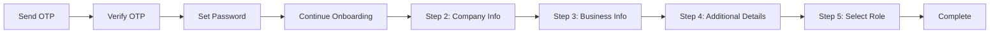

# Onboarding API

## Overview
The Onboarding API manages the complete user registration process through a multi-step wizard. It handles email verification, password setup, and company profile creation in 5 distinct steps.

## Base URL
```
/onboarding
```

## Authentication
Most endpoints require an onboarding or account JWT token passed in the `Authorization` header.

---

## Onboarding Flow



---

## Endpoints

### 1. Send Email OTP

Sends a 6-digit OTP to the provided email address.

**Endpoint:** `POST /onboarding/send-otp`

**Authentication:** Not required

**Request Body:**
```json
{
  "email": "string"  // Valid email address
}
```

**Response:**

**Success (200 OK):**
```json
"string"  // Confirmation message
```

**Error (500):**
```json
{
  "statusCode": 500,
  "message": "error message"
}
```

---

### 2. Verify Email OTP

Verifies the OTP and generates an onboarding token.

**Endpoint:** `POST /onboarding/verify-otp`

**Authentication:** Not required

**Request Body:**
```json
{
  "email": "string",  // Valid email address
  "otp": "string"     // Exactly 6 digits
}
```

**Response:**

**Success (200 OK):**
```json
"string"  // Onboarding JWT token
```

**Error (400):**
```json
{
  "statusCode": 400,
  "message": "error message"
}
```

**Implementation Notes:**
- Returns a temporary onboarding token
- This token is used for subsequent onboarding steps
- Token should be stored and sent in `Authorization` header

---

### 3. Validate Onboarding Token

Validates the onboarding token.

**Endpoint:** `POST /onboarding/validate-token`

**Authentication:** Required (onboarding token)

**Headers:**
```
Authorization: Bearer <onboarding_token>
```

**Request Body:** None

**Response:**

**Success (200 OK):**
```json
// Decoded token payload
```

**Error (400):**
```json
{
  "statusCode": 400,
  "message": "error message"
}
```

---

### 4. Set Password

Sets the user's password after OTP verification.

**Endpoint:** `POST /onboarding/set-password`

**Authentication:** Required (onboarding token)

**Headers:**
```
Authorization: Bearer <onboarding_token>
```

**Request Body:**
```json
{
  "setPassword": "string",      // Min 8 chars, complexity requirements
  "confirmPassword": "string"   // Must match setPassword
}
```

**Password Requirements:**
- Minimum 8 characters
- At least one uppercase letter
- At least one lowercase letter
- At least one number
- At least one special character (`!@#$%^&*(),.?":{}|<>`)

**Response:**

**Success (200 OK):**
```json
{
  "message": "Onboarding continued successfully",
  "data": {
    // User/company data
  }
}
```

**Error (500):**
```json
{
  "statusCode": 500,
  "message": "error message"
}
```

---

### 5. Validate Account Token

Validates the account JWT token.

**Endpoint:** `POST /onboarding/validate-account-token`

**Authentication:** Required (account token)

**Headers:**
```
Authorization: Bearer <account_token>
```

**Response:**

**Success (200 OK):**
```json
"string"  // Decoded payload or userId
```

**Error (400):**
```json
{
  "statusCode": 400,
  "message": "error message"
}
```

---

### 6. Continue Onboarding

Continues the onboarding process after setting password.

**Endpoint:** `POST /onboarding/continue-onboarding`

**Authentication:** Required (onboarding token)

**Headers:**
```
Authorization: Bearer <onboarding_token>
```

**Request Body:**
```json
{
  "password": "string"  // User's password
}
```

**Response:**

**Success (200 OK):**
```json
{
  "message": "Onboarding continued successfully",
  "data": {
    // Session/user data
  }
}
```

**Error (500):**
```json
{
  "statusCode": 500,
  "message": "error message"
}
```

---

### 7. Step 2: Company Information

Collects basic company information.

**Endpoint:** `POST /onboarding/step-2`

**Authentication:** Required (account token)

**Headers:**
```
Authorization: Bearer <account_token>
```

**Request Body:**
```json
{
  "companyName": "string",     // Required
  "companyAddress": "string",  // Required
  "companyMobile": "string",   // Required
  "taxId": "string"            // Required (e.g., GST number)
}
```

**Response:**

**Success (200 OK):**
```json
{
  "message": "Step 2 completed successfully",
  "data": {
    // Updated company data
  }
}
```

**Error (500):**
```json
{
  "statusCode": 500,
  "message": "error message"
}
```

**Implementation Notes:**
- Updates `onboardingProgress` to 2
- All fields are mandatory

---

### 8. Step 3: Business Information

Collects business line and revenue information.

**Endpoint:** `POST /onboarding/step-3`

**Authentication:** Required (account token)

**Headers:**
```
Authorization: Bearer <account_token>
```

**Request Body:**
```json
{
  "mainLineBusiness": ["string"],  // Array of business lines
  "meanMonthlyRevenue": "enum"     // Revenue bracket (see below)
}
```

**Mean Monthly Revenue Enum:**
- `"Less than 1k Dollar"`
- `"1k Dollars - 10k Dollars"`
- `"10k Dollars - 100k Dollars"`
- `"100k Dollars - 1000k Dollars"`
- `"More than 1000k Dollars"`

**Response:**

**Success (200 OK):**
```json
{
  "message": "Step 3 completed successfully",
  "data": {
    // Updated company data
  }
}
```

**Error (500):**
```json
{
  "statusCode": 500,
  "message": "error message"
}
```

**Validation:**
- `mainLineBusiness` must have at least one item
- `meanMonthlyRevenue` must be one of the enum values

---

### 9. Step 4: Additional Details

Collects website, founder, and export information.

**Endpoint:** `POST /onboarding/step-4`

**Authentication:** Required (account token)

**Headers:**
```
Authorization: Bearer <account_token>
```

**Request Body:**
```json
{
  "websiteUrl": "string",       // Optional
  "founderName": "string",      // Required
  "exportedBefore": boolean,    // Required
  "referrel": "string"          // Required (how they heard about us)
}
```

**Response:**

**Success (200 OK):**
```json
{
  "message": "Step 4 completed successfully",
  "data": {
    // Updated company data
  }
}
```

**Error (500):**
```json
{
  "statusCode": 500,
  "message": "error message"
}
```

---

### 10. Step 5: Select Role

Selects the company's role (Buyer/Seller/Both).

**Endpoint:** `POST /onboarding/step-5`

**Authentication:** Required (account token)

**Headers:**
```
Authorization: Bearer <account_token>
```

**Request Body:**
```json
{
  "role": "enum"  // Role selection (see below)
}
```

**Role Enum:**
- `"Buyer"`
- `"Seller"`
- `"Seller and Buyer"`

**Response:**

**Success (200 OK):**
```json
{
  "message": "Step 5 completed successfully",
  "data": {
    // Updated company data with role
  }
}
```

**Error (500):**
```json
{
  "statusCode": 500,
  "message": "error message"
}
```

**Implementation Notes:**
- This is the final step of onboarding
- Should set `isOnboardingCompleted` to `true`

---

### 11. Get Onboarding Progress

Retrieves the current onboarding progress and details.

**Endpoint:** `POST /onboarding/get-onboarding-progress-details`

**Authentication:** Required (account token)

**Headers:**
```
Authorization: Bearer <account_token>
```

**Request Body:** None

**Response:**

**Success (200 OK):**
```json
{
  "message": "Onboarding progress retrieved successfully",
  "company": {
    "onboardingProgress": number,     // 0-5
    "isOnboardingCompleted": boolean,
    "companyName": "string",
    "companyAddress": "string",
    // ... other company fields
  }
}
```

**Error (500):**
```json
{
  "statusCode": 500,
  "message": "error message"
}
```

**Implementation Notes:**
- Use this to determine which step to show the user
- If `isOnboardingCompleted` is `true`, redirect to main app

---

## Data Transfer Objects (DTOs)

### SendEmailOtpDto
```typescript
{
  email: string;  // Valid email format
}
```

### VerifyEmailOtpDto
```typescript
{
  email: string;  // Valid email format
  otp: string;    // Exactly 6 characters
}
```

### SetPasswordDto
```typescript
{
  setPassword: string;      // Password complexity requirements
  confirmPassword: string;  // Must match setPassword
}
```

### Step2Dto
```typescript
{
  companyName: string;
  companyAddress: string;
  companyMobile: string;
  taxId: string;
}
```

### Step3Dto
```typescript
{
  mainLineBusiness: string[];      // At least one item
  meanMonthlyRevenue: MeanMonthlyRevenue;
}
```

### Step4Dto
```typescript
{
  websiteUrl: string;      // Optional
  founderName: string;
  exportedBefore: boolean;
  referrel: string;
}
```

### Step5Dto
```typescript
{
  role: Role;  // "Buyer" | "Seller" | "Seller and Buyer"
}
```

---

## Onboarding State Management

### Company Schema Fields
```typescript
{
  onboardingProgress: number;        // 0-5, tracks current step
  isOnboardingCompleted: boolean;   // true when all steps done
  // ... other company fields populated during onboarding
}
```

---

## Frontend Integration Notes

1. **Step-by-Step Flow:**
   - Always check `onboardingProgress` to determine current step
   - Use `/get-onboarding-progress-details` on app load
   - Show appropriate step based on progress value

2. **Token Management:**
   - Store onboarding token after `/verify-otp`
   - Switch to account token after `/set-password` or `/continue-onboarding`
   - Send token in `Authorization: Bearer <token>` header

3. **Form Validation:**
   - Implement client-side validation matching DTO requirements
   - Display server validation errors to users
   - highlight required fields

4. **Progress Indicator:**
   - Show visual progress (e.g., "Step 2 of 5")
   - Allow users to go back to previous steps if needed
   - Store partial progress on each step completion

5. **Error Handling:**
   - Handle network errors gracefully
   - Allow users to retry failed steps
   - Don't lose form data on errors

---

## Related Modules
- **Auth Module:** For session management after onboarding
- **Login Module:** For returning users
- **Company Module:** Company data is populated during onboarding
- **Users Module:** User account created during onboarding
