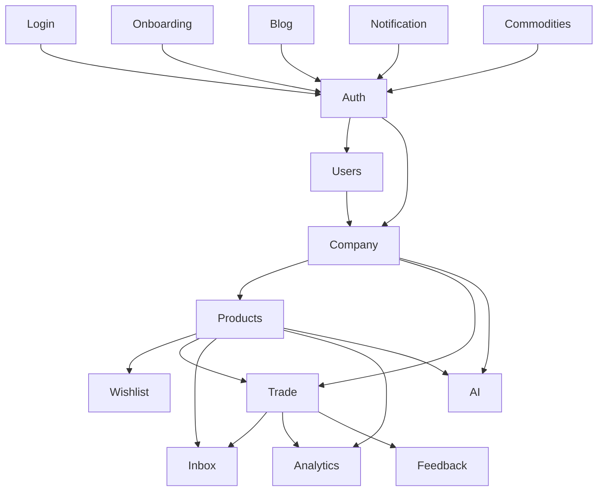
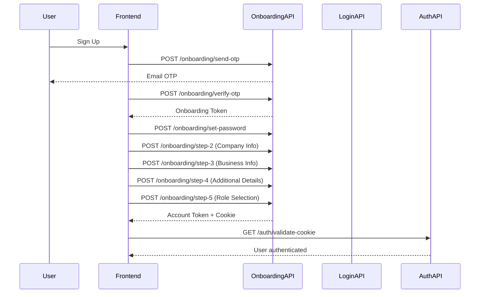
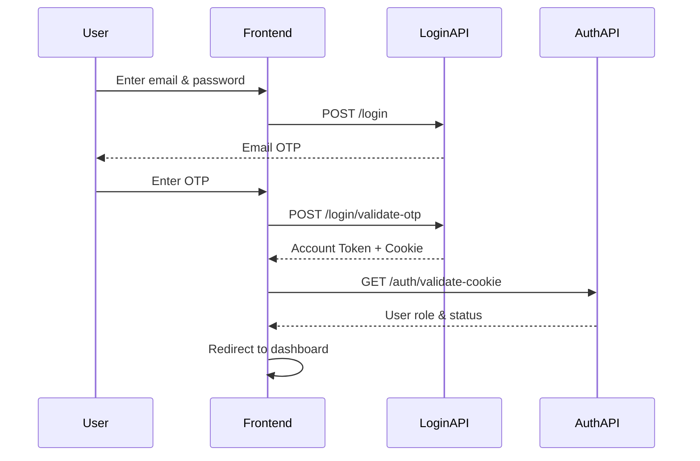
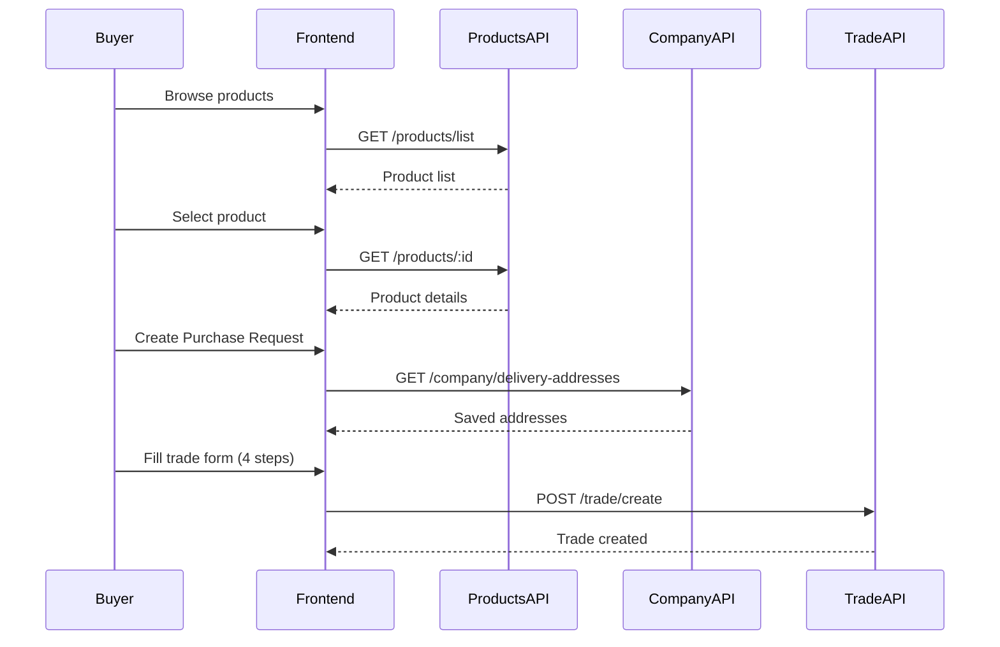
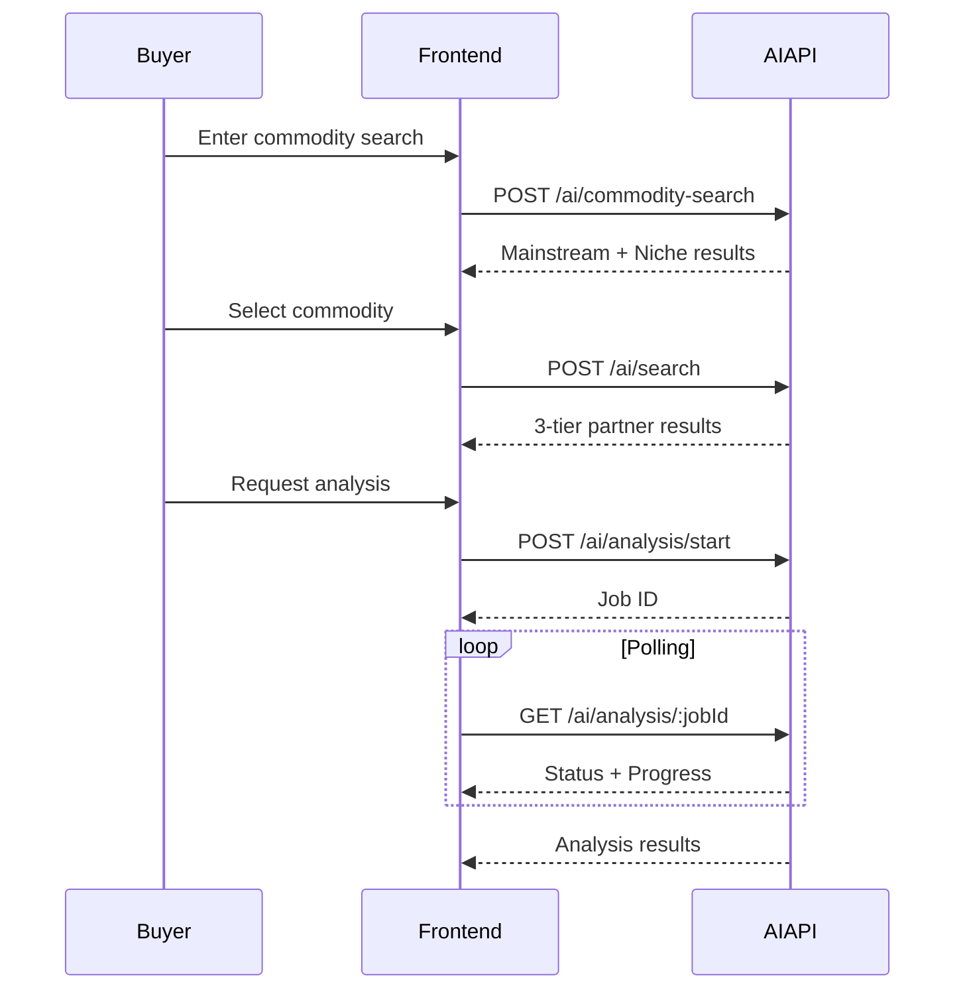

# Breyus API Documentation

## Overview

This directory contains comprehensive API documentation for the Breyus B2B commodity trading platform. The documentation is structured by module, with each file covering a specific functional area of the API.

---

## Module Documentation

### Core Modules

1. **[Authentication](./auth.md)** - Session validation and user info retrieval
   - Validate authentication cookies
   - Get current user information
   - Password reset and change
   - Session management

2. **[Login](./login.md)** - User authentication
   - Email/password login with OTP
   - OTP validation and session creation
   - Cookie-based authentication
   - Rate limiting

3. **[Onboarding](./onboarding.md)** - User registration and company setup
   - 5-step registration wizard
   - Email verification with OTP
   - Company profile creation
   - Role selection (Buyer/Seller/Both)

### Business Modules

4. **[Products](./products.md)** - Product catalog management
   - Create products with file uploads
   - HSN code search/autocomplete
   - Product listing with pagination and filters
   - Product details retrieval
   - Visibility and inventory management

5. **[Trade](./trade.md)** - Trade/purchase request management
   - Create purchase requests
   - Multi-round negotiation with counter-offers
   - Document uploads (SCO, ICPO, SPA, BoL)
   - Phase advancement and completion
   - PDF generation
   - Dispute handling

6. **[Company](./company.md)** - Company profile and settings
   - Delivery address management (CRUD)
   - KYC document management
   - Profile and banner images
   - Public company profiles
   - GST verification

7. **[AI](./ai.md)** - AI-powered features
   - Trade partner search with 3-tier results
   - Commodity search (mainstream/niche detection)
   - Market analysis with demand forecasting
   - Gravity score calculation
   - Link prediction waterfall

8. **[Commodities](./commodities.md)** - Commodity market data
   - Real-time commodity prices
   - Price history for sparklines
   - Category-based filtering
   - Alpha Vantage integration

### Supporting Modules

9. **[Wishlist](./wishlist.md)** - Save favorite products
   - Add/remove products from wishlist
   - Save AI contacts
   - Favourite companies
   - Contact notes

10. **[Inbox](./inbox.md)** - Messaging and conversations
    - Create conversations between companies
    - Send and receive messages
    - Message reactions and editing
    - WebSocket gateway for real-time messaging

11. **[Users](./users.md)** - User account management
    - User profile information
    - Notification preferences
    - AI Buddy notification settings

12. **[Analytics](./analytics.md)** - Dashboard metrics and charts
    - Key performance metrics
    - Time series data
    - Top products (radar chart)
    - Export as CSV/PDF

13. **[Blog](./blog.md)** - Public blog content
    - Published posts with personalization
    - Featured, pinned, trending posts
    - Category and tag filtering
    - Newsletter subscription

14. **[Feedback](./feedback.md)** - Trade feedback and ratings
    - Submit feedback for trades
    - Seller, delivery, and product ratings
    - Feedback analytics dashboard

15. **[Notification](./notification.md)** - User notifications
    - Paginated notification list
    - Mark as read/unread
    - Unread count badges
    - 35+ notification types

### Admin Portal

16. **[Admin](./admin.md)** - Admin portal API (15 controllers)
    - Admin authentication with sessions
    - User management (suspend, password reset, GDPR export)
    - Company and KYC management
    - Trade management (notes, force phase, documents)
    - Dispute handling and resolution
    - Dashboard and analytics
    - System health and maintenance
    - Content management (currencies, countries, ports, HSN)
    - Blog management (posts, writers, comments)
    - Product moderation
    - Alert rules and security

---

## API Base URL

```
Development: http://localhost:3001
Production: <production-url>
Docs Route: http://localhost:3001/docs
```

---

## Authentication

All API endpoints (except public onboarding and login endpoints) require authentication via signed HTTP-only cookies.

### Cookie-Based Authentication

The API uses a cookie named `account` which contains a signed JWT token.

**Cookie Details:**
- **Name:** `account`
- **Type:** Signed, HTTP-only
- **Expiry:** Configurable (default: 24 hours)
- **Secure:** true in production
- **SameSite:** strict in production, none in development

**Setting the Cookie:**
- Cookie is automatically set upon successful login (`POST /login/validate-otp`)
- Frontend doesn't need to manually manage the token
- Cookie is included automatically in all same-origin requests

**Validating Authentication:**
```
GET /auth/validate-cookie
```

---

## Common Request/Response Patterns

### Successful Response Format

Most endpoints follow this response structure:

```json
{
  "statusCode": 200,
  "message": "Success message",
  "data": {
    // Response data
  }
}
```

### Error Response Format

```json
{
  "statusCode": 400,
  "message": "Error message",
  "error": "Detailed error information"
}
```

### Common Status Codes

- **200 OK:** Successful GET request
- **201 Created:** Successful POST request (resource created)
- **400 Bad Request:** Validation error or invalid input
- **401 Unauthorized:** Missing or invalid authentication
- **403 Forbidden:** Authenticated but not authorized
- **404 Not Found:** Resource not found
- **429 Too Many Requests:** Rate limit exceeded
- **500 Internal Server Error:** Server-side error

---

## Data Models

### Common Types

#### Incoterms
```typescript
type IncotermType =
  | 'EXW'  // Ex Works
  | 'FCA'  // Free Carrier
  | 'FAS'  // Free Alongside Ship
  | 'FOB'  // Free on Board
  | 'CFR'  // Cost and Freight
  | 'CIF'  // Cost, Insurance and Freight
  | 'CPT'  // Carriage Paid To
  | 'CIP'  // Carriage and Insurance Paid To
  | 'DAP'  // Delivered at Place
  | 'DPU'  // Delivered at Place Unloaded
  | 'DDP'; // Delivered Duty Paid

```

#### Company Roles
```typescript
enum Role {
  BUYER = 'Buyer',
  SELLER = 'Seller',
  BOTH = 'Seller and Buyer'
}
```

#### Trade Type
```typescript
enum TradeType {
  INTERNATIONAL = 'international',
  DOMESTIC = 'domestic'
}
```

#### Payment Method Types
```typescript
type PaymentType = 'advance' | 'credit' | 'openAccount';
type PaymentMethodType = 'RTGS' | 'LetterOfCredit';
```

---

## Module Dependencies



---

## API Usage Flow

### New User Flow



### Existing User Flow



### Trade Creation Flow



### AI Search Flow



---

## Frontend Integration Guidelines

### 1. API Client Setup

```javascript
// api/client.js
import axios from 'axios';

const apiClient = axios.create({
  baseURL: process.env.REACT_APP_API_URL,
  withCredentials: true, // Important: Send cookies with requests
});

// Response interceptor for error handling
apiClient.interceptors.response.use(
  (response) => response.data,
  (error) => {
    if (error.response?.status === 401) {
      // Redirect to login
      window.location.href = '/login';
    }
    if (error.response?.status === 429) {
      // Handle rate limiting
      console.warn('Rate limit exceeded. Please wait.');
    }
    return Promise.reject(error);
  }
);

export default apiClient;
```

### 2. Authentication Check

```javascript
// hooks/useAuth.js
import { useState, useEffect } from 'react';
import apiClient from '../api/client';

export const useAuth = () => {
  const [user, setUser] = useState(null);
  const [loading, setLoading] = useState(true);

  useEffect(() => {
    const checkAuth = async () => {
      try {
        const { valid, role } = await apiClient.get('/auth/validate-cookie');
        if (valid) {
          const { companyId, userId } = await apiClient.get('/auth/me');
          setUser({ role, companyId, userId });
        }
      } catch (error) {
        setUser(null);
      } finally {
        setLoading(false);
      }
    };

    checkAuth();
  }, []);

  return { user, loading };
};
```

### 3. API Service Layer

```javascript
// services/products.service.js
import apiClient from '../api/client';

export const productsService = {
  getProducts: (params) =>
    apiClient.get('/products/list', { params }),

  getProduct: (id) =>
    apiClient.get(`/products/${id}`),

  createProduct: (formData) =>
    apiClient.post('/products/add-product', formData, {
      headers: { 'Content-Type': 'multipart/form-data' }
    }),

  getUserProducts: () =>
    apiClient.get('/products/user-products'),

  searchHSN: (query) =>
    apiClient.get('/products/hsn', { params: { q: query } })
};
```

### 4. Error Handling

```javascript
try {
  const result = await apiClient.post('/endpoint', data);
  // Handle success
} catch (error) {
  if (error.response) {
    // Server responded with error
    const { statusCode, message } = error.response.data;
    showError(message);
  } else if (error.request) {
    // Network error
    showError('Network error. Please check your connection.');
  } else {
    // Other errors
    showError('An unexpected error occurred.');
  }
}
```

---

## Development Guidelines

### When Implementing a Feature

1. **Reference the API documentation** for the module you're working with
2. **Check context folder** for additional requirements and specifications
3. **Update this documentation** if you add/modify endpoints
4. **Update the feature tracking** in `context/Breyus — Complete Backend Feature.md`
5. **Test all endpoints** before marking as complete

### Adding New Endpoints

1. Create/update the controller
2. Create/update DTOs and schemas
3. Update the corresponding API documentation file
4. Add integration examples
5. Document in the feature tracking file

### API Documentation Standards

Each API documentation file should include:
- Overview and purpose
- Base URL
- Authentication requirements
- All endpoints with:
  - HTTP method and path
  - Request parameters/body
  - Response format
  - Error responses
  - Implementation notes
- Data models and schemas
- Frontend integration notes
- Related modules

---

## Environment Variables

Required environment variables for the backend:

```bash
# Database
MONGODB_URI=mongodb://localhost:27017/breyus

# JWT Secrets
JWT_SECRET=<your-secret-key>
ONBOARDING_JWT_SECRET=<onboarding-secret>

# Cookie Configuration
COOKIE_EXPIRY_LOGIN=86400000  # 24 hours in milliseconds
COOKIE_SECRET=<cookie-signature-secret>

# Email Service (for OTP)
MAIL_SERVICE_API_KEY=<your-mail-service-key>

# Environment
NODE_ENV=development|production

# AI Server
AI_SERVER_URL=http://localhost:8000
AI_API_KEY=<ai-server-api-key>

# Commodity Prices
ALPHA_VANTAGE_API_KEY=<alpha-vantage-key>
```

---

## Testing the API

### Using cURL

```bash
# Login
curl -X POST http://localhost:3001/login \
  -H "Content-Type: application/json" \
  -d '{"mail":"user@example.com","password":"Password123!"}'

# Validate cookie (after login)
curl -X GET http://localhost:3001/auth/validate-cookie \
  -b "account=<cookie-value>" \
  --cookie-jar cookies.txt

# Get products
curl -X GET "http://localhost:3001/products/list?page=1&limit=20" \
  -b cookies.txt

# AI Search
curl -X POST http://localhost:3001/ai/search \
  -H "Content-Type: application/json" \
  -b cookies.txt \
  -d '{"searchType":"buyer","commodity":"wheat","country":"India"}'
```

### Using Postman

1. Import the API collection (if available)
2. Set up environment variables
3. Enable "Save cookies" in Postman settings
4. Login to get the session cookie
5. All subsequent requests will include the cookie automatically

---

## Glossary

- **PR**: Purchase Request
- **SCO**: Soft Corporate Offer
- **ICPO**: Irrevocable Corporate Purchase Order
- **SPA**: Sales Purchase Agreement
- **BoL**: Bill of Lading
- **HSN**: Harmonized System Nomenclature (product classification code)
- **MOQ**: Minimum Order Quantity
- **KYC**: Know Your Customer
- **Incoterms**: International Commercial Terms (shipping responsibilities)
- **CIS**: Company Identification Sheet
- **GST**: Goods and Services Tax

---

## Support and Questions

For questions about the API or to report issues:
1. Check the relevant module documentation
2. Review the `context/` folder for additional specifications
3. Check the backend implementation in `backend/src/`
4. Consult with the backend team

---

## Changelog

### Version 1.2 (Current - February 2025)
- **AI Module:** NEW - Complete AI documentation with link prediction, market analysis, gravity scoring
- **Admin Module:** NEW - Comprehensive admin portal docs covering 15 controllers
- **Blog Module:** NEW - Public blog API with personalization and newsletter
- **Commodities Module:** NEW - Real-time commodity prices with Alpha Vantage
- **Feedback Module:** NEW - Trade feedback and rating system
- **Notification Module:** NEW - User notification management (35+ types)
- **Products API:** Updated with visibility toggle, company products, view tracking
- **Trade API:** Updated with PDF generation, dispute handling, signed SPA
- **Company API:** Updated with KYC management, profile media, public profiles
- **Wishlist API:** Updated with AI contacts, favourite companies
- **Inbox API:** Updated with reactions, message editing, WebSocket events
- **Users API:** Updated with AI notification preferences
- **Analytics API:** Updated with sales metrics, time series, export functionality
- **Auth API:** Updated with rate limiting documentation
- **Login API:** Updated with testing bypass flow and rate limiting

### Version 1.1
- **Auth Module:** Added logout, forgot-password, reset-password, change-password endpoints
- **Login Module:** Complete rewrite with OTP-based 2-step authentication flow
- **Trade Module:** Major update with negotiation, document uploads, and phase management (18 endpoints total)
- **Inbox Module:** Added WebSocket gateway documentation for real-time messaging
- **Analytics Module:** NEW - Dashboard metrics and chart data endpoints
- **Company Module:** Added profile management endpoints
- **Users Module:** Updated schema documentation with password reset fields
- **Wishlist Module:** Updated schema documentation with correct field names

### Version 1.0
- Initial API documentation
- Core modules: Auth, Login, Onboarding
- Business modules: Products, Trade, Company
- Supporting modules: Wishlist, Inbox, Users
- Complete endpoint documentation with examples
