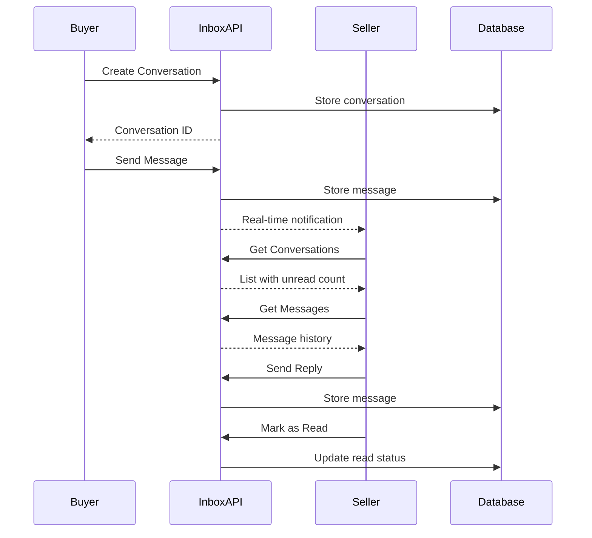

# Inbox / Messaging API

## Overview
The Inbox API manages conversations and messages between buyers and sellers. It provides functionality for creating conversations, sending messages, retrieving message history, and marking messages as read. The module includes both REST API endpoints and WebSocket support for real-time messaging.

## Base URL
```
/inbox
```

## Authentication
All endpoints require authentication via signed cookie. Protected by AuthGuard which validates:
- Cookie-based JWT authentication
- User existence in database
- User is not suspended

---

## Conversation and Messaging Flow



---

## REST API Endpoints

### 1. Create Conversation

Creates a new conversation between companies (typically buyer and seller).

**Endpoint:** `POST /inbox/create-conversation`

**Authentication:** Required (signed cookie)

**Request Body:**
```json
{
  "product": "string",         // Optional: MongoDB ObjectId of the product (for product inquiries)
  "targetCompanyId": "string"  // Optional: MongoDB ObjectId of the target company (for direct conversations)
}
```

**Note:** At least one of `product` or `targetCompanyId` must be provided.

**Response:**

**Success (201 Created):**
```json
"507f1f77bcf86cd799439011"  // Conversation ID (MongoDB ObjectId)
```

**Error Responses:**

**400 Bad Request:**
```json
{
  "statusCode": 400,
  "message": "Failed to Create Conversation"
}
```
*Possible reasons:*
- Conversation already exists between these companies
- Invalid targetCompanyId or product ID
- Neither product nor targetCompanyId provided

**401 Unauthorized:**
```json
{
  "statusCode": 401,
  "message": "No valid cookie found"
}
```
or
```json
{
  "statusCode": 401,
  "message": "Invalid token"
}
```

**Implementation Notes:**
- `senderCompanyId` is automatically extracted from JWT token
- **Idempotent:** If conversation already exists between the same companies, returns the existing conversation ID (201 status, not an error)
- Returns the conversation ID for immediate use
- Supports two modes: product-based (existing flow) or direct company-to-company
- Validates: self-conversation blocked ("You can't send a message to yourself"), product existence, target company existence

---

### 2. Get User's Conversations

Retrieves all conversations for the authenticated user's company.

**Endpoint:** `GET /inbox/get-conversations`

**Authentication:** Required (signed cookie)

**Request:** No parameters required

**Response:**

**Success (200 OK):**
```json
[
  {
    "id": "507f1f77bcf86cd799439011",
    "productName": "Premium Basmati Rice",
    "companyName": "Company B",
    "profilePicture": "/uploads/profile/company-b.jpg",
    "participantNames": ["Company A", "Company B"],
    "companyIds": ["companyId1", "companyId2"],
    "unreadCount": 3,
    "lastMessage": "Hello, I'm interested...",
    "lastMessageTime": "2024-01-01T12:00:00.000Z"
  }
]
```

> **Note:** The response is a transformed array. Key differences from raw schema:
> - Uses `id` (not `_id`)
> - `companyName` is the OTHER participant's name (not the current user's)
> - `lastMessage` is a plain string (not an object)
> - `lastMessageTime` is a separate field
> - `profilePicture` is the other company's profile picture

**Error Responses:**

**401 Unauthorized:**
```json
{
  "statusCode": 401,
  "message": "No valid cookie found"
}
```
or
```json
{
  "statusCode": 401,
  "message": "Invalid token"
}
```

**Implementation Notes:**
- Returns conversations where user's company is a participant
- Sorted by most recent activity
- Includes unread message count for the current user's company
- Populates participant company details

---

### 3. Get Messages in Conversation

Retrieves all messages in a specific conversation.

**Endpoint:** `GET /inbox/:conversationId/messages`

**Authentication:** Required (signed cookie)

**Path Parameters:**
- `conversationId` (string, required): MongoDB ObjectId of the conversation

**Request Example:**
```
GET /inbox/507f1f77bcf86cd799439011/messages
```

**Response:**

**Success (200 OK):**
```json
[
  {
    "_id": "507f1f77bcf86cd799439011",
    "text": "Hello, I'm interested in this product.",
    "sender": {
      "_id": "companyId1",
      "companyName": "Company A"
    },
    "receiver": {
      "_id": "companyId2",
      "companyName": "Company B"
    },
    "readBy": ["companyId1"],
    "replyTo": {
      "_id": "replyMsgId",
      "text": "Original message text",
      "sender": "companyId1",
      "createdAt": "2024-01-01T11:00:00.000Z"
    },
    "reactions": [
      {
        "user": "companyId2",
        "emoji": "thumbsup",
        "reactedAt": "2024-01-01T12:30:00.000Z"
      }
    ],
    "editedAt": null,
    "createdAt": "2024-01-01T12:00:00.000Z"
  }
]
```

**Error Responses:**

**401 Unauthorized:**
```json
{
  "statusCode": 401,
  "message": "No valid cookie found"
}
```
or
```json
{
  "statusCode": 401,
  "message": "No companyId found"
}
```

**404 Not Found:**
```json
{
  "statusCode": 404,
  "message": "Not a participant"
}
```

**Implementation Notes:**
- Verifies user's company is a participant in the conversation (returns 404 if not)
- Messages ordered chronologically (oldest first)
- Sender and receiver company details are populated
- `attachments` field is NOT included in message responses (stripped by `formatMessage()`)
- `replyTo` is populated as an object `{ _id, text, sender, createdAt }` when present, not a raw ID
- All messages in the conversation are returned

---

### 4. Send Message

Sends a message in a conversation.

**Endpoint:** `POST /inbox/:conversationId/send-message`

**Authentication:** Required (signed cookie)

**Path Parameters:**
- `conversationId` (string, required): MongoDB ObjectId of the conversation

**Request Body:**
```json
{
  "text": "string",     // Required: Message text content
  "replyTo": "string"   // Optional: MongoDB ObjectId of message being replied to
}
```

**Request Example:**
```
POST /inbox/507f1f77bcf86cd799439011/send-message
{
  "text": "Hello, I'm interested in this product.",
  "replyTo": "507f1f77bcf86cd799439012"
}
```

**Response:**

**Success (201 Created):**
```json
{
  "_id": "507f1f77bcf86cd799439011",
  "text": "Hello, I'm interested in this product.",
  "sender": {
    "_id": "companyId1",
    "companyName": "Company A"
  },
  "receiver": {
    "_id": "companyId2",
    "companyName": "Company B"
  },
  "readBy": ["companyId1"],
  "replyTo": {
    "_id": "507f1f77bcf86cd799439012",
    "text": "Original message",
    "sender": "companyId2",
    "createdAt": "2024-01-01T11:00:00.000Z"
  },
  "reactions": [],
  "createdAt": "2024-01-01T12:00:00.000Z"
}
```

> **Note:** `attachments` is NOT included in message responses (stripped by `formatMessage()`). `replyTo` is populated as an object when present.

**Error Responses:**

**401 Unauthorized:**
```json
{
  "statusCode": 401,
  "message": "No valid cookie found"
}
```
or
```json
{
  "statusCode": 401,
  "message": "No companyId found"
}
```

**500 Internal Server Error:**
```json
{
  "statusCode": 500,
  "message": "Failed to send message"
}
```

**Implementation Notes:**
- Automatically extracts `senderCompanyId` from JWT token
- Message is marked as read by sender automatically
- Updates conversation with the new message
- Supports reply threading via `replyTo` field
- `attachments` field is NOT included in message responses
- **WebSocket side effect:** Also creates notifications for the receiver company's users and emits `notification-created` events

---

### 5. Mark Messages as Read

Marks all messages in a conversation as read by the authenticated user's company.

**Endpoint:** `POST /inbox/:conversationId/mark-read`

**Authentication:** Required (signed cookie)

**Path Parameters:**
- `conversationId` (string, required): MongoDB ObjectId of the conversation

**Request Body:** None required

**Request Example:**
```
POST /inbox/507f1f77bcf86cd799439011/mark-read
```

**Response:**

**Success (200 OK):**
```json
{
  "success": true
}
```

**Error Responses:**

**401 Unauthorized:**
```json
{
  "statusCode": 401,
  "message": "No valid cookie found"
}
```
or
```json
{
  "statusCode": 401,
  "message": "No companyId found"
}
```

**500 Internal Server Error:**
```json
{
  "statusCode": 500,
  "message": "Failed to mark messages as read"
}
```

**Implementation Notes:**
- Adds user's companyId to `readBy` array of all unread messages
- Resets unread count for the user's company
- Idempotent operation (safe to call multiple times)

---

## WebSocket Gateway

The Inbox module includes a WebSocket gateway for real-time messaging capabilities with authenticated connections.

### Connection

**Namespace:** `/inbox`

**CORS:** Configured via `CORS_ORIGIN` environment variable

**Authentication:** JWT cookie-based authentication is validated on connection. Unauthenticated connections are immediately disconnected with an `auth-error` event.

```javascript
import { io } from 'socket.io-client';

const socket = io(`${BACKEND_URL}/inbox`, {
  withCredentials: true,  // Required for cookie auth
});

// Handle authentication errors
socket.on('auth-error', (data) => {
  console.error('Auth failed:', data.message);
  // Redirect to login
});
```

### WebSocket Events

#### Client -> Server Events

##### 1. join-conversation
Join a conversation room to receive real-time updates.

**Payload:**
```json
{
  "conversationId": "string"
}
```

**Note:** `companyId` is extracted from the authenticated socket, not from payload.

**Response:**
```json
{
  "success": true,
  "room": "conversation-<conversationId>"
}
```

**Error Response:**
```json
{
  "success": false,
  "error": "Not authenticated"
}
```

---

##### 2. leave-conversation
Leave a conversation room.

**Payload:**
```json
{
  "conversationId": "string"
}
```

**Response:**
```json
{
  "success": true
}
```

---

##### 3. send-message
Send a message via WebSocket (real-time).

**Payload:**
```json
{
  "conversationId": "string",
  "text": "string",
  "replyTo": "string | null"  // Optional: message ID being replied to
}
```

**Response:**
```json
{
  "success": true,
  "message": {
    "_id": "string",
    "text": "string",
    "sender": { "_id": "string", "companyName": "string" },
    "receiver": { "_id": "string", "companyName": "string" },
    "readBy": ["string"],
    "replyTo": "string | null",
    "reactions": [],
    "createdAt": "2024-01-01T00:00:00.000Z"
  }
}
```

**Error Response:**
```json
{
  "success": false,
  "error": "Not authenticated"
}
```

---

##### 4. mark-read
Mark messages as read via WebSocket.

**Payload:**
```json
{
  "conversationId": "string"
}
```

**Response:**
```json
{
  "success": true
}
```

---

##### 5. typing
Send typing indicator to other participants.

**Payload:**
```json
{
  "conversationId": "string",
  "isTyping": true | false
}
```

**Response:**
```json
{
  "success": true
}
```

---

##### 6. edit-message
Edit an existing message.

**Payload:**
```json
{
  "conversationId": "string",
  "messageId": "string",
  "text": "string"
}
```

**Response:**
```json
{
  "success": true,
  "message": {
    "_id": "string",
    "text": "string (updated)",
    "editedAt": "2024-01-01T12:30:00.000Z",
    "editedBy": "companyId"
  }
}
```

**Error Response:**
```json
{
  "success": false,
  "error": "Cannot edit message - not the sender"
}
```

---

##### 7. toggle-reaction
Add or remove a reaction to a message.

**Payload:**
```json
{
  "conversationId": "string",
  "messageId": "string",
  "emoji": "string"
}
```

**Response:**
```json
{
  "success": true,
  "message": {
    "_id": "string",
    "reactions": [
      {
        "user": "companyId",
        "emoji": "thumbsup",
        "reactedAt": "2024-01-01T12:30:00.000Z"
      }
    ]
  }
}
```

---

#### Server -> Client Events

##### 1. message-received
Emitted when a new message is sent to the conversation.

**Payload:**
```json
{
  "conversationId": "string",
  "message": {
    "_id": "string",
    "text": "string",
    "sender": { "_id": "string", "companyName": "string" },
    "receiver": { "_id": "string", "companyName": "string" },
    "readBy": ["string"],
    "replyTo": "string | null",
    "reactions": [],
    "createdAt": "2024-01-01T00:00:00.000Z"
  }
}
```

---

##### 2. messages-marked-read
Emitted when messages are marked as read.

**Payload:**
```json
{
  "conversationId": "string",
  "companyId": "string"
}
```

---

##### 3. user-typing
Emitted when another user is typing.

**Payload:**
```json
{
  "conversationId": "string",
  "companyId": "string",
  "isTyping": true | false
}
```

---

##### 4. message-updated
Emitted when a message is edited or a reaction is toggled.

**Payload:**
```json
{
  "conversationId": "string",
  "message": {
    "_id": "string",
    "text": "string",
    "editedAt": "2024-01-01T12:30:00.000Z",
    "reactions": []
  }
}
```

---

##### 5. auth-error
Emitted when socket authentication fails.

**Payload:**
```json
{
  "message": "Authentication failed. Please log in again."
}
```

---

## WebSocket Frontend Integration

```javascript
import { io } from 'socket.io-client';

// Connect to WebSocket with credentials
const socket = io(`${BACKEND_URL}/inbox`, {
  withCredentials: true,
});

// Handle authentication errors
socket.on('auth-error', (data) => {
  console.error('Auth failed:', data.message);
  window.location.href = '/login';
});

// Join conversation
socket.emit('join-conversation', {
  conversationId: 'conv123'
}, (response) => {
  if (response.success) {
    console.log('Joined room:', response.room);
  }
});

// Send message
socket.emit('send-message', {
  conversationId: 'conv123',
  text: 'Hello!',
  replyTo: null
}, (response) => {
  if (response.success) {
    console.log('Message sent:', response.message);
  }
});

// Listen for new messages
socket.on('message-received', (data) => {
  console.log('New message:', data.message);
  // Update UI with new message
});

// Listen for typing indicators
socket.on('user-typing', (data) => {
  if (data.isTyping) {
    showTypingIndicator(data.companyId);
  } else {
    hideTypingIndicator(data.companyId);
  }
});

// Listen for message updates (edits, reactions)
socket.on('message-updated', (data) => {
  console.log('Message updated:', data.message);
  // Update message in UI
});

// Send typing indicator
const handleTyping = (isTyping) => {
  socket.emit('typing', {
    conversationId: 'conv123',
    isTyping
  });
};

// Edit message
socket.emit('edit-message', {
  conversationId: 'conv123',
  messageId: 'msg123',
  text: 'Updated message text'
}, (response) => {
  if (response.success) {
    console.log('Message edited');
  }
});

// Toggle reaction
socket.emit('toggle-reaction', {
  conversationId: 'conv123',
  messageId: 'msg123',
  emoji: 'thumbsup'
});

// Mark as read
socket.emit('mark-read', {
  conversationId: 'conv123'
});

// Leave conversation
socket.emit('leave-conversation', {
  conversationId: 'conv123'
});

// Disconnect
socket.disconnect();
```

---

## Data Models

### Conversation Schema
```typescript
{
  _id: ObjectId;
  participants: ObjectId[];           // Array of company IDs
  product?: ObjectId;                 // Ref: Product (optional)
  messages: ObjectId[];               // Ref: Message array
  createdAt: Date;
  updatedAt: Date;
}
```

### Message Schema
```typescript
{
  _id: ObjectId;
  text: string;                       // Message content
  sender: ObjectId;                   // Ref: Company
  receiver: ObjectId;                 // Ref: Company
  readBy: ObjectId[];                 // Companies who read this message
  replyTo?: ObjectId;                 // Ref: Message (for threading)
  reactions: {                        // Emoji reactions
    user: ObjectId;                   // Ref: Company
    emoji: string;
    reactedAt: Date;
  }[];
  editedAt?: Date;                    // When message was last edited
  editedBy?: ObjectId;                // Ref: Company who edited
  attachments: {                      // File attachments
    filePath: string;
    fileName: string;
    mimeType: string;
  }[];
  senderDeleted: boolean;             // Soft-delete if sender company deleted
  senderDeletedAt?: Date;
  receiverDeleted: boolean;           // Soft-delete if receiver company deleted
  receiverDeletedAt?: Date;
  createdAt: Date;
  updatedAt: Date;
}
```

---

## Frontend Integration Notes

### 1. Conversation List (Inbox)

**Display:**
```jsx
<ConversationList>
  {conversations.map(conv => (
    <ConversationItem key={conv._id}>
      <Avatar company={getOtherParticipant(conv)} />
      <ConversationInfo>
        <CompanyName>{getOtherParticipant(conv).companyName}</CompanyName>
        <LastMessage>{conv.lastMessage?.text}</LastMessage>
        <Timestamp>{formatTime(conv.lastMessage?.createdAt)}</Timestamp>
      </ConversationInfo>
      {conv.unreadCount > 0 && (
        <UnreadBadge>{conv.unreadCount}</UnreadBadge>
      )}
    </ConversationItem>
  ))}
</ConversationList>
```

### 2. Message Thread

**Display:**
```jsx
<MessageThread>
  {messages.map(msg => (
    <Message
      key={msg._id}
      isOwn={msg.sender._id === myCompanyId}
    >
      {msg.replyTo && <ReplyPreview message={msg.replyTo} />}
      <MessageBubble>
        <Text>{msg.text}</Text>
        <Timestamp>{formatTime(msg.createdAt)}</Timestamp>
        {msg.editedAt && <EditedLabel>edited</EditedLabel>}
        {msg.readBy.length > 1 && <ReadReceipt />}
      </MessageBubble>
      <Reactions reactions={msg.reactions} />
    </Message>
  ))}
</MessageThread>

<MessageInput onSend={sendMessage} />
```

### 3. Creating Conversations

**From Product Page:**
```javascript
const contactSeller = async (productId) => {
  // Check if conversation exists
  const existing = conversations.find(c =>
    c.product === productId
  );

  if (existing) {
    navigateTo(`/inbox/${existing._id}`);
  } else {
    const convId = await createConversation({ product: productId });
    navigateTo(`/inbox/${convId}`);
  }
};
```

**Direct Company Contact:**
```javascript
const contactCompany = async (companyId) => {
  const convId = await createConversation({ targetCompanyId: companyId });
  navigateTo(`/inbox/${convId}`);
};
```

---

## Best Practices

1. **Performance:**
   - Paginate message history for long conversations
   - Implement virtual scrolling for large message lists
   - Cache conversation list locally

2. **User Experience:**
   - Show typing indicators in real-time
   - Display "sending..." state for messages
   - Optimistic message rendering
   - Auto-scroll to bottom on new messages

3. **Notifications:**
   - Browser notifications for new messages
   - Update document title with unread count
   - Play sound on new message (with user preference)

4. **Error Handling:**
   - Retry failed message sends
   - Show error state for failed messages
   - Offline message queuing

---

## Related Modules
- **Trade Module:** Conversations created for trade discussions
- **Products Module:** Conversations for product inquiries
- **Company Module:** Participants are companies
- **Auth Module:** User/company authentication
- **Notification Module:** Message notifications

## Related
- [[api/trade]] — Trade discussions
- [[api/notification]] — Message notifications
- [[MOC-API]]
