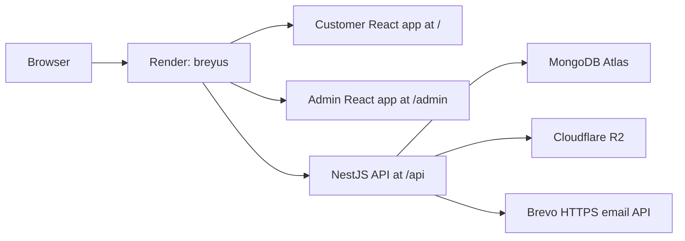

# Render Free Deployment Runbook

This is the source of truth for the **current portfolio deployment**. It explains how to make a change, deploy it, verify it, roll it back, and recreate the service without depending on prior setup knowledge.

The larger DigitalOcean design in [[DEPLOYMENT]] is a future production target. It is not the infrastructure currently serving the public site.

## Current Live Deployment

| Setting | Current value |
|---|---|
| Public URL | [https://breyus.onrender.com](https://breyus.onrender.com) |
| Render dashboard | [Open the `breyus` service](https://dashboard.render.com/web/srv-d9dm12urnols73cnv1e0) |
| Render service name | `breyus` |
| Render service ID | `srv-d9dm12urnols73cnv1e0` |
| Render plan and region | Free web service, Singapore |
| GitHub repository | `BREYUS-CREW/Breyus` |
| Deployment branch | `deploy/portfolio-showcase` |
| Deploy trigger | Automatic after a commit is pushed to the deployment branch |
| Runtime | Docker, built from `Dockerfile.showcase` |
| Health check | `/api/health` |
| Main database | MongoDB Atlas Free |
| File storage | Cloudflare R2, bucket `breyus-showcase` |
| Transactional email | Brevo Free through the HTTPS API |

Keep the Render service name exactly `breyus`. Adding a suffix creates a different public hostname. Renaming an existing Render service does not reliably replace its original hostname, so create it with the correct name from the start.

## What Runs in the Service

One Docker image builds and serves three applications:



The NestJS process serves both compiled frontends, the API, uploaded files proxied from R2, and Socket.IO. This is intentionally simpler than the future multi-service production design.

## Files That Control Deployment

| File | Purpose |
|---|---|
| `Dockerfile.showcase` | Builds the customer app, admin portal, and backend into one runtime image |
| `render.yaml` | Documents the Render service shape and non-secret environment settings |
| `backend/src/main.ts` | Mounts `/api`, `/admin`, `/uploads`, Socket.IO, and SPA fallbacks |

The customer and admin API paths are compiled as `/api` by `Dockerfile.showcase`; there are no separate production `.env` files for those builds. The Render dashboard is the source of truth for secret values and the live service connection. Values marked `sync: false` in `render.yaml` must be entered in Render and must never be committed.

## Normal Change and Deploy Workflow

### 1. Work from the deployment branch

```bash
git switch deploy/portfolio-showcase
git pull origin deploy/portfolio-showcase
```

Pushing only to `main` does not update this deployment. Merge or cherry-pick the intended change onto `deploy/portfolio-showcase` before deploying it.

### 2. Make and validate the change

Run the checks for every application you changed:

```bash
# Customer frontend
cd frontend
npm ci --legacy-peer-deps
npm run build

# Backend
cd ../backend
npm ci
npm run build
npm test

# Admin portal
cd ../admin-portal
npm ci
npm run build
npm run lint
```

Return to the repository root. For a deployment-sensitive change, also test the real image locally if Docker is available:

```bash
docker build -f Dockerfile.showcase -t breyus-showcase:local .
```

### 3. Commit and push

```bash
git status --short
git add <only-the-files-you-intended-to-change>
git commit -m "<clear description of the change>"
git push origin deploy/portfolio-showcase
```

Render detects the new commit, builds the image, checks `/api/health`, and switches traffic only after the new deployment is healthy.

### 4. Watch the deployment

In Render, open **Dashboard → breyus → Events**. Wait until the deployment says **Live**. A build can take several minutes.

The same checks are available from the Render CLI:

```bash
render deploys list srv-d9dm12urnols73cnv1e0
render logs --resources srv-d9dm12urnols73cnv1e0 --limit 100 --output text
```

## Manual Deploy

Use a manual deploy when automatic deployment did not start or when the service must be rebuilt without a new commit.

From the dashboard, open **breyus → Manual Deploy → Deploy latest commit**.

From the CLI:

```bash
render deploys create srv-d9dm12urnols73cnv1e0 --wait --confirm
```

To deploy a specific commit:

```bash
render deploys create srv-d9dm12urnols73cnv1e0 --commit <commit-sha> --wait --confirm
```

## Environment Variables

Open **Render Dashboard → breyus → Environment** to change them. Use **Save, rebuild, and deploy** when the running application must receive the new value.

### Required non-secret settings

| Variable | Value |
|---|---|
| `NODE_ENV` | `production` |
| `APP_NAME` | `Breyus` |
| `API_GLOBAL_PREFIX` | `api` |
| `STATIC_SITE_ROOT` | `/app/public` |
| `CORS_ORIGIN` | `https://breyus.onrender.com` |
| `FRONTEND_URL` | `https://breyus.onrender.com` |
| `ADMIN_PORTAL_URL` | `https://breyus.onrender.com/admin` |
| `COOKIE_SECURE` | `true` |
| `COOKIE_EXPIRY_LOGIN` | `86400000` |
| `ADMIN_SESSION_EXPIRY` | `86400000` |
| `EMAIL_PROVIDER` | `brevo` |
| `EMAIL_FROM_NAME` | `Breyus` |
| `EMAIL_FROM` | `badri.supernetrix@gmail.com` |
| `STORAGE_PROVIDER` | `s3` |
| `S3_REGION` | `auto` |
| `S3_BUCKET` | `breyus-showcase` |
| `S3_PUBLIC_URL` | `/uploads` |

### Required secrets

These must exist in Render, but their values must stay out of Git and documentation:

- `JWT_SECRET_KEY`
- `COOKIE_SECRET`
- `MONGODB_URI_PROD`
- `S3_ENDPOINT`
- `S3_ACCESS_KEY`
- `S3_SECRET_KEY`
- `BREVO_API_KEY`

Do not casually regenerate the JWT or cookie secrets. Existing browser sessions will become invalid.

### Brevo email setup and rotation

Render Free blocks the SMTP ports normally used by Gmail and other mail servers. Breyus therefore sends OTP and password-reset mail through Brevo's HTTPS API.

1. Sign in to [Brevo](https://app.brevo.com/) with `badri.supernetrix@gmail.com`.
2. Open **Settings → Senders, Domains & Dedicated IPs → Senders**.
3. Add `Breyus <badri.supernetrix@gmail.com>` and complete the code verification sent to that inbox.
4. Open **SMTP & API → API Keys**, create a v3 API key, and copy it once. Do not use an SMTP key.
5. Open **Render → breyus → Environment**, set `BREVO_API_KEY`, and choose **Save, rebuild, and deploy**.
6. Keep `EMAIL_FROM` identical to the verified Brevo sender. A different address will be rejected.

Never commit or document the key value. To rotate it, create a replacement in Brevo, update Render, verify a real OTP, and then delete the old key. Brevo Free currently allows 300 transactional sends per day; the application also limits one client IP to three OTP sends per minute on each running instance.

If the page reports that delivery is unavailable, check Render logs for `Email delivery failed`, then check the Brevo transactional log and sender status. The backend deliberately returns an error instead of displaying a false success message when Brevo rejects a request.

### Optional integrations not currently configured

- AI: requires a deployed AI service plus `AI_SERVER_URL` and `AI_API_KEY`.
- Commodity prices: requires `ALPHA_VANTAGE_API_KEY`.

## Post-Deployment Verification

Allow for a cold start, then run:

```bash
curl -fsS https://breyus.onrender.com/api/health
curl -sS -o /dev/null -w '%{http_code}\n' https://breyus.onrender.com/
curl -sS -o /dev/null -w '%{http_code}\n' https://breyus.onrender.com/login
curl -sS -o /dev/null -w '%{http_code}\n' https://breyus.onrender.com/onboarding
curl -sS -o /dev/null -w '%{http_code}\n' https://breyus.onrender.com/blog
curl -sS -o /dev/null -w '%{http_code}\n' https://breyus.onrender.com/admin/
curl -sS -o /dev/null -w '%{http_code}\n' 'https://breyus.onrender.com/socket.io/?EIO=4&transport=polling'
```

Expected result: health returns JSON and each page request returns HTTP `200`.

Also verify these flows in a real browser:

1. Public home, login, onboarding, blog, and admin pages render without blank screens.
2. Sign in with an existing completed account.
3. An incomplete registration resumes at the remaining onboarding step.
4. Completing onboarding returns to sign-in, not the meeting-booking page.
5. Request an OTP for an inbox you control, confirm the email arrives, and submit the received six-digit code successfully.
6. At least one uploaded image loads through `/uploads/...`.

## Rollback

If the latest deployment is broken:

1. Open **Render Dashboard → breyus → Events**.
2. Select the most recent known-good deployment.
3. Choose **Rollback to this deploy**.
4. Verify the health endpoint and browser flows above.
5. Fix the deployment branch, push the correction, and re-enable automatic deployment if the dashboard rollback disabled it.

The free plan retains only a small number of previous deploys. Prefer fixing forward quickly and keep Git history clean enough to identify the last good commit.

## Recreate the Service

Do this only if the current service cannot be repaired. Reusing the exact default hostname requires a short outage because the existing service owns `breyus.onrender.com`; a second service cannot be fully verified at that same hostname first.

1. First try a manual deploy or **Clear build cache & deploy** on the existing service.
2. If recreation is unavoidable, record every non-secret setting and store the current secret values in a secure password manager. Confirm MongoDB Atlas and R2 are still accessible independently of Render.
3. Schedule a short maintenance window, then remove the failed service so the hostname can be reused.
4. In Render, choose **New → Web Service** and connect `BREYUS-CREW/Breyus`.
5. Set the service name to exactly `breyus`.
6. Select branch `deploy/portfolio-showcase`.
7. Select Docker and set Dockerfile path to `./Dockerfile.showcase` with context `.`.
8. Select the Free plan and Singapore region.
9. Set the health check path to `/api/health`.
10. Add the non-secret settings and manually enter every required secret listed above.
11. Deploy and complete the full verification checklist immediately.

Do not create an improvised public name with extra suffixes. If zero-downtime service replacement becomes necessary, configure a custom domain first; the default Render hostname is not suitable for a blue-green migration with the same name.

## Persistence and Safety

- Render's local filesystem is ephemeral. Never treat files written inside the container as durable.
- User and application data must remain in MongoDB Atlas.
- Uploads must remain in Cloudflare R2.
- Never commit `.env` files, database URIs, access keys, app passwords, or copied Render environment exports.
- Do not run demo seed or destructive cleanup scripts against the live database unless the target records are confirmed first.

## Current Free-Tier Limitations

- The service sleeps after a period without HTTP or WebSocket traffic. The first request can take about a minute while it wakes.
- Email OTP delivery is unavailable until an HTTPS email provider is configured.
- The AI service is not deployed; AI health can return `503` without affecting the core showcase.
- Live commodity prices remain empty until an API key is configured.
- Free services do not provide an interactive shell or persistent disk.

These are acceptable for a portfolio demo, but they should be disclosed rather than presented as fully operational production features.

## Troubleshooting

### Git push says repository not found

The local SSH key may be authenticated as a different GitHub account. Confirm the intended account and use GitHub CLI HTTPS credentials:

```bash
gh auth status
git -c credential.helper='!gh auth git-credential' push https://github.com/BREYUS-CREW/Breyus.git deploy/portfolio-showcase
```

### The site is slow or initially returns an error

Wait about a minute and retry `/api/health`. This is usually a free-tier cold start. Check Render events and logs if health still fails.

### A frontend route returns a 404

Confirm the latest image includes the SPA fallback in `backend/src/main.ts` and that `STATIC_SITE_ROOT=/app/public`.

### An API request returns HTML

Confirm the route begins with `/api`. A missing prefix sends the request to the frontend fallback.

### Login or cookies work locally but not live

Confirm `COOKIE_SECURE=true` and that `CORS_ORIGIN`, `FRONTEND_URL`, and `ADMIN_PORTAL_URL` exactly match the live HTTPS URL.

### Uploads disappear after redeploy

Confirm `STORAGE_PROVIDER=s3` and all R2 variables. Local container storage is temporary and is not a valid repair.

## Official Render References

- [Free web service behavior and limits](https://render.com/docs/free)
- [Deploys and automatic deploys](https://render.com/docs/deploys)
- [Environment variables and secrets](https://render.com/docs/configure-environment-variables)
- [Docker services](https://render.com/docs/docker)
- [Rollbacks](https://render.com/docs/rollbacks)

## Related

- [[DEPLOYMENT]] — future DigitalOcean production architecture
- [[MOC-Operations]]
- [[SECRET_MANAGEMENT]]
- [[MONITORING_AND_ALERTING]]
